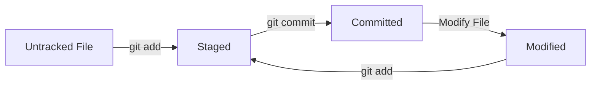

# Lesson 06: Checking Repository Status (`git status`)

## Overview

The `git status` command displays the current state of your repository. It tells you what has changed, what is staged for commit, what is not yet staged, and whether your local branch is synchronized with the remote repository.

This is one of the most frequently used Git commands and should become part of your daily workflow.

---

## Learning Objectives

After completing this lesson, you will be able to:

* Understand the purpose of `git status`
* Interpret the output of `git status`
* Identify tracked and untracked files
* Distinguish staged and unstaged changes
* Determine whether your branch is up to date with the remote repository

---

## Prerequisites

* Completed Lessons 01–05
* A Git repository initialized with `git init`

---

## Why `git status` Matters

Before making any commit, you should always know the current state of your repository.

`git status` answers questions like:

* Which files have changed?
* Which files are staged?
* Which files are untracked?
* Is my working tree clean?
* Is my branch ahead or behind GitHub?

---

## Syntax

```bash
git status
```

---

## Example

```bash
git status
```

Example output:

```text
On branch main
Your branch is up to date with 'origin/main'.

Changes not staged for commit:
  modified: README.md

Untracked files:
  docs/06-git-status.md

no changes added to commit
```

---

## Understanding the Output

### Current Branch

```text
On branch main
```

Shows the branch you are currently working on.

---

### Branch Status

```text
Your branch is up to date with 'origin/main'.
```

This means your local branch and the remote branch have the same commits.

---

### Changes Not Staged

```text
modified: README.md
```

The file has been modified but has **not** been added to the staging area.

---

### Untracked Files

```text
docs/06-git-status.md
```

Git has detected a new file, but it is not yet tracking it.

---

### Working Tree Clean

If there are no pending changes, Git displays:

```text
nothing to commit, working tree clean
```

This means all changes have been committed and your working directory is clean.

---

## File States

A file in Git moves through these states:

| State     | Description                            |
| --------- | -------------------------------------- |
| Untracked | A new file that Git is not tracking    |
| Modified  | A tracked file that has changed        |
| Staged    | A file prepared for the next commit    |
| Committed | A file saved in the repository history |

---

## Git Workflow



---

## Real-World Example

Suppose you're working on this handbook.

* You create `06-git-status.md`.
* Git reports it as **Untracked**.
* You stage it using `git add`.
* Git reports it as **Changes to be committed**.
* You commit it.
* Git reports **working tree clean**.

This workflow repeats for almost every change you make.

---

## Common Mistakes

* Forgetting to run `git status` before committing.
* Assuming modified files are already staged.
* Ignoring untracked files that should be committed.
* Committing unrelated changes together.

---

## Best Practices

* Run `git status` frequently.
* Review changes before staging them.
* Keep your working tree clean whenever possible.
* Make small, focused commits.

---

## Practice Exercises

1. Run `git status`.
2. Create a new file.
3. Run `git status` again.
4. Modify an existing file.
5. Observe how Git reports the changes.
6. Predict what will happen after `git add`.

---

## Interview Questions

1. What information does `git status` provide?
2. What is the difference between an untracked and a modified file?
3. What does "working tree clean" mean?
4. Why should developers run `git status` frequently?
5. Is `git status` a safe command? Why?

---

## Summary

In this lesson, you learned:

* The purpose of `git status`
* How to interpret its output
* The different file states in Git
* Why checking repository status is an essential habit

---

## Next Lesson

**Lesson 07: Staging Changes with `git add`**

You'll learn how to move files from the Working Directory to the Staging Area and prepare them for commits.
