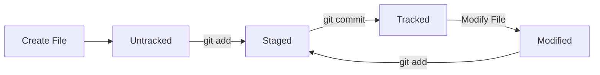

# Lesson 07: Tracking Changes in Git

## Overview

One of Git's greatest strengths is its ability to detect and track changes made to your project. Every time you create, modify, rename, or delete a file, Git can identify those changes and help you decide whether they should become part of your project's history.

This lesson explains how Git tracks changes and introduces the lifecycle of a file inside a Git repository.

---

## Learning Objectives

After completing this lesson, you will be able to:

* Understand how Git tracks files
* Explain the lifecycle of a file in Git
* Distinguish between tracked and untracked files
* Understand modified, staged, and committed states
* Read the output of `git status` with confidence

---

## Prerequisites

* Completed Lessons 01–06
* Basic understanding of the Working Directory and Staging Area

---

## What Does "Tracking" Mean?

When Git tracks a file, it monitors changes made to that file over time.

Once a file has been committed, Git remembers its previous version and can detect:

* Content changes
* File deletions
* File renames
* File movements

Tracking allows Git to build the complete history of your project.

---

## Tracked vs Untracked Files

### Tracked Files

A tracked file is a file that Git already knows about.

Examples:

* Files committed previously
* Files staged for the next commit

Git monitors these files for changes.

---

### Untracked Files

An untracked file is a new file that Git has discovered but is not yet managing.

Example:

```text
notes.txt
```

If you create `notes.txt`, Git will report it as an untracked file until you add it to the staging area.

---

## The File Lifecycle

Every file moves through a series of states.



---

## File States

### Untracked

Git sees the file but is not tracking it.

Example:

```text
Untracked files:
    notes.txt
```

---

### Modified

The file is already tracked, but its contents have changed.

Example:

```text
modified: README.md
```

---

### Staged

The latest version of the file has been added to the staging area and is ready for the next commit.

---

### Committed

The file has been permanently recorded in the repository history.

---

## Real-World Example

Suppose your repository contains:

```text
README.md
app.py
requirements.txt
```

You create:

```text
notes.txt
```

Running:

```bash
git status
```

shows:

```text
Untracked files:
    notes.txt
```

Now stage it:

```bash
git add notes.txt
```

Running `git status` again:

```text
Changes to be committed:
    new file: notes.txt
```

Finally, commit it:

```bash
git commit -m "Add project notes"
```

The file is now fully tracked by Git.

---

## Why Tracking Matters

Tracking enables Git to:

* Compare different versions of a file
* Restore previous versions
* Merge changes from multiple developers
* Detect conflicts
* Maintain a complete project history

Without tracking, Git would have no way to know what changed.

---

## Common Mistakes

* Assuming Git automatically tracks every new file.
* Forgetting to stage new files before committing.
* Ignoring untracked files that should be part of the project.
* Accidentally committing temporary or generated files.

---

## Best Practices

* Review untracked files regularly.
* Add only files that belong in the repository.
* Use a `.gitignore` file for temporary files.
* Keep commits focused on a single logical change.

---

## Practice Exercises

1. Create a file named `notes.txt`.
2. Run `git status`.
3. Observe that the file is untracked.
4. Stage the file.
5. Run `git status` again.
6. Commit the file.
7. Modify the file and observe its state change to **Modified**.

---

## Interview Questions

1. What is a tracked file?
2. What is an untracked file?
3. When does a file become tracked?
4. What happens after modifying a tracked file?
5. Why doesn't Git automatically track every new file?

---

## Summary

In this lesson, you learned:

* How Git tracks files
* The lifecycle of a file
* The difference between tracked and untracked files
* How files move through different states
* Why tracking is fundamental to Git

---

## Next Lesson

**Lesson 08: Creating Commits with `git commit`**

You'll learn how Git creates snapshots of your project, how commit messages should be written, and what happens internally when a commit is created.
