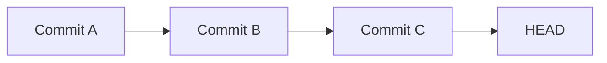

# Lesson 09: Viewing Project History with `git log`

## Overview

Every commit you create becomes part of your repository's history. Git stores this history as a chain of commits, allowing you to review previous changes, understand project evolution, and restore earlier versions if needed.

The `git log` command displays this commit history.

---

## Learning Objectives

After completing this lesson, you will be able to:

- View commit history
- Understand commit hashes
- Read commit metadata
- Display concise and detailed logs
- Search and filter commit history

---

## Prerequisites

- Completed Lessons 01–08
- At least one commit in your repository

---

# Why Project History Matters

Imagine you're asked:

- Who added this feature?
- When was this bug introduced?
- Which commit changed this file?
- What was the previous version?

The answer to all of these questions begins with `git log`.

---

# Basic Syntax

Display the complete commit history:

```bash
git log
```

---

## Example Output

```text
commit 9aebb856d7f2c1d9d5a2c6e9c85b1d2a5b8c3f11
Author: Musthafa <your-email@example.com>
Date:   Fri Jul 24 16:45:12 2026 +0530

    Add Lesson 08: Git commits

commit a9eacfb9f0d4e6b1d9f93ab1c8b1d4d95efab321

Author: Musthafa <your-email@example.com>
Date:   Fri Jul 24 15:10:05 2026 +0530

    Add Lesson 07: Tracking changes
```

Each commit contains:

- Commit hash
- Author
- Date
- Commit message

---

# Understanding the Commit Hash

Example:

```text
9aebb856d7f2c1d9d5a2c6e9c85b1d2a5b8c3f11
```

This is a unique identifier for the commit.

Git uses commit hashes to:

- Identify commits
- Compare versions
- Restore previous states
- Create branches
- Merge histories

No two commits share the same hash.

---

# Useful `git log` Options

### Compact View

```bash
git log --oneline
```

Example:

```text
9aebb85 Add Lesson 08: Git commits
a9eacfb Add Lesson 07: Tracking changes
6f1d20b Add Lesson 06: Git status
```

---

### Show Last 5 Commits

```bash
git log -5
```

---

### One-Line Last 5 Commits

```bash
git log --oneline -5
```

---

### Display Commit Graph

```bash
git log --graph --oneline --all
```

Example:

```text
* 9aebb85 Add Lesson 08: Git commits
* a9eacfb Add Lesson 07: Tracking changes
* 6f1d20b Add Lesson 06: Git status
```

This becomes especially useful when working with branches.

---

## How Git Stores History

Git links commits together.



Each commit points to its parent commit, forming a complete history.

---

## Real-World Example

Suppose a bug appears after adding a feature.

Using:

```bash
git log
```

You can identify:

- The commit that introduced the feature
- Who created it
- When it was committed
- The associated commit message

This makes debugging much easier.

---

## Best Practices

- Write meaningful commit messages.
- Review history regularly.
- Keep commits small and focused.
- Use `git log --oneline` for quick reviews.

---

## Common Mistakes

- Writing vague commit messages.
- Creating huge commits that are difficult to understand.
- Ignoring project history.
- Forgetting that every commit should tell part of the project's story.

---

## Practice Exercises

1. Run `git log`.
2. Run `git log --oneline`.
3. Display the last three commits.
4. Display the commit graph.
5. Compare the outputs of each command.

---

## Interview Questions

1. What does `git log` do?
2. What information is stored in a commit?
3. What is a commit hash?
4. Why is `git log --oneline` useful?
5. How does Git connect commits together?

---

## Summary

In this lesson, you learned:

- How to view commit history
- How to interpret commit metadata
- The purpose of commit hashes
- Useful `git log` options
- How Git stores project history

Understanding project history is essential for debugging, collaboration, and maintaining software.

---

## Next Lesson

**Lesson 10: Understanding HEAD**

You'll learn what `HEAD` is, how Git knows your current position in history, and why `HEAD` is one of the most important concepts in Git.