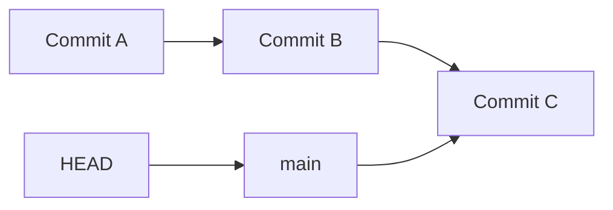
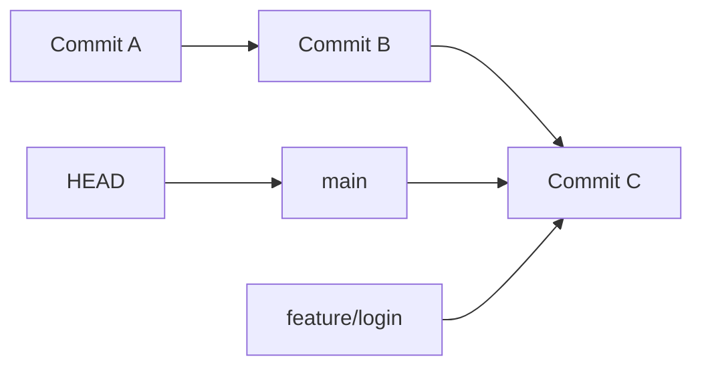

# Lesson 11: Git Branching

## Overview

One of Git's greatest strengths is its lightweight and powerful branching system. A branch allows you to develop new features, fix bugs, or experiment with ideas without affecting the main codebase.

Unlike many older version control systems, Git creates branches almost instantly because a branch is simply a pointer to a commit.

---

## Learning Objectives

After completing this lesson, you will be able to:

- Understand what a Git branch is
- Explain why branches are used
- Create, switch, rename, and delete branches
- Understand how `HEAD` and branches work together
- Visualize branch pointers internally
- Follow branching best practices

---

## Prerequisites

- Lessons 01–10
- Understanding of commits and `HEAD`

---

# What is a Branch?

A branch is a **named pointer to a commit**.

It is **not** a copy of your project.

When you create a branch, Git simply creates another pointer that references the current commit.

For example:

```text
A --- B --- C
              ↑
            main
```

Here, `main` points to commit **C**.

---

# Why Do We Need Branches?

Imagine you're working on a production application.

You need to:

- Add a new feature
- Fix a critical bug
- Experiment with a new idea

If you make all these changes directly on `main`, you risk breaking the stable version of your project.

Instead, create a branch.

```
main
 │
 └── feature/login
```

Now you can work independently without affecting the main branch.

---

# How Branches Work Internally

Initially:



Create a new branch:

```bash
git branch feature/login
```

Now:



Notice:

- No new commits were created.
- Git only added another pointer.

This is why branch creation is extremely fast.

---

# Listing Branches

```bash
git branch
```

Example:

```text
* main
  feature/login
```

The `*` indicates the current branch (`HEAD`).

---

# Creating a Branch

```bash
git branch feature/login
```

This creates a new branch but **does not switch to it**.

---

# Switching Branches

```bash
git switch feature/login
```

or (older syntax):

```bash
git checkout feature/login
```

Now:

```
HEAD → feature/login
```

---

# Create and Switch in One Command

```bash
git switch -c feature/profile
```

Equivalent to:

```bash
git branch feature/profile
git switch feature/profile
```

---

# Making a Commit on a Branch

Suppose the repository looks like this:

```text
A --- B --- C
             ↑
          main
```

Create and switch:

```bash
git switch -c feature/login
```

Now make a commit.

```
A --- B --- C --- D
                   ↑
            feature/login
```

Meanwhile:

```
main
  ↓
  C
```

Notice that `main` is unchanged.

---

# Renaming a Branch

Rename the current branch:

```bash
git branch -m new-name
```

Rename another branch:

```bash
git branch -m old-name new-name
```

---

# Deleting a Branch

Delete a merged branch:

```bash
git branch -d feature/login
```

Force delete:

```bash
git branch -D feature/login
```

Be careful with `-D`, as it can delete unmerged work.

---

# Real-World Workflow

A common team workflow:

```
main
 │
 ├── feature/login
 │
 ├── feature/payment
 │
 ├── feature/dashboard
 │
 └── bugfix/header
```

Each developer works on a separate branch.

Once the work is complete, it is reviewed and merged into `main`.

---

# Best Practices

- Never develop directly on `main`.
- Use descriptive branch names.
- Keep branches focused on one task.
- Delete branches after merging.
- Update your branch regularly from the main branch.

---

# Common Branch Naming Conventions

```text
feature/login

feature/payment

bugfix/header

hotfix/security

release/v2.0
```

---

# Common Mistakes

- Doing all work on `main`
- Using unclear branch names
- Keeping branches alive for months
- Mixing multiple features in one branch
- Forgetting to delete merged branches

---

# Practice Exercises

1. List all branches.
2. Create a branch named `feature/profile`.
3. Switch to it.
4. Verify the current branch.
5. Create a dummy file.
6. Commit the change.
7. Switch back to `main`.
8. Observe that the new commit exists only on the feature branch.

---

# Interview Questions

1. What is a Git branch?
2. Is a branch a copy of the repository?
3. Why are Git branches fast?
4. What does `HEAD` point to?
5. Difference between `git branch` and `git switch`?
6. Difference between `git switch -c` and `git branch`?

---

# Summary

In this lesson, you learned:

- What a Git branch is
- Why branches exist
- How branches work internally
- Creating, switching, renaming, and deleting branches
- Branch naming conventions
- Best practices for working with branches

Understanding branches is essential for collaborative software development and lays the foundation for merging, rebasing, and pull requests.

---

## Next Lesson

**Lesson 12: Git Merging**

You'll learn how Git combines branches, what fast-forward and three-way merges are, and how merge commits are created.