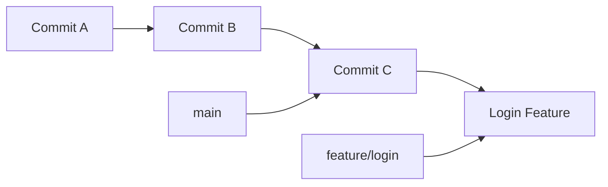
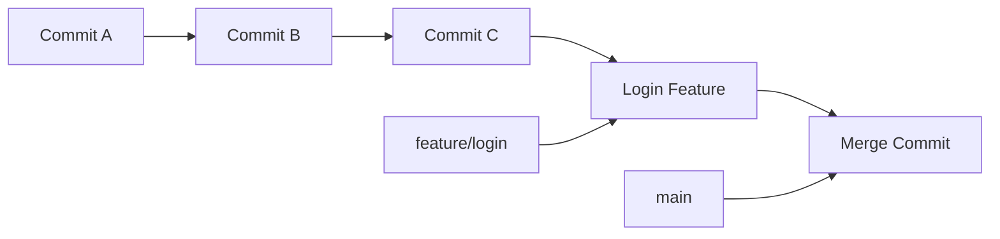

# Lesson 12: Git Merging

## Overview

After developing features on separate branches, the next step is to combine those changes into a single branch. This process is called **merging**.

Git provides powerful merge capabilities that preserve project history while combining work from multiple developers.

---

## Learning Objectives

After completing this lesson, you will be able to:

- Understand what a merge is
- Explain how Git performs a merge
- Perform fast-forward and three-way merges
- Understand merge commits
- Visualize merge history
- Follow merge best practices

---

## Prerequisites

- Lessons 01–11
- Understanding of commits and branches

---

# What is a Merge?

A merge combines the history of one branch into another.

For example:

```
main
  │
  └── feature/login
```

Once the feature is complete, you merge it back into `main`.

---

# Why Merge?

Imagine two developers working simultaneously.

Developer A:

- Adds a login page

Developer B:

- Fixes a payment bug

Both changes need to become part of the same project.

Git merging makes this possible.

---

# Basic Merge Workflow

Current branch:

```text
main
```

Switch to the destination branch:

```bash
git switch main
```

Merge another branch:

```bash
git merge feature/login
```

Git combines the changes from `feature/login` into `main`.

---

# Before the Merge



---

# After the Merge



The `main` branch now includes the work from `feature/login`.

---

# Fast-Forward Merge

Suppose no one has changed `main`.

Repository:

```text
A --- B --- C
             \
              D
```

When you merge:

```bash
git merge feature/login
```

Git simply moves the `main` pointer forward.

Result:

```text
A --- B --- C --- D
                  ↑
                main
```

No merge commit is needed.

This is called a **fast-forward merge**.

---

# Three-Way Merge

Suppose both branches have changed.

Before:

```text
          D
         /
A --- B --- C
         \
          E
```

Now Git cannot simply move a pointer.

Instead, it creates a new commit.

Result:

```text
          D
         / \
A --- B --- C --- F
         \     /
          E ---
```

Commit **F** is called a **merge commit**.

---

# Merge Commit

A merge commit has **two parent commits**.

Normal commit:

```
Parent → Commit
```

Merge commit:

```
Parent 1
      \
       Merge Commit
      /
Parent 2
```

This allows Git to preserve the complete history of both branches.

---

# Viewing Merge History

```bash
git log --graph --oneline --all
```

Example:

```text
*   f91b23 Merge branch 'feature/login'
|\
| * d34ac5 Add login page
* | 73ad12 Fix homepage
|/
* 89ab21 Initial commit
```

The graph clearly shows where branches diverged and merged.

---

# Merge vs Rebase

Merge:

- Preserves branch history
- Creates merge commits when needed
- Best for collaborative development

Rebase:

- Rewrites commit history
- Produces a linear history
- Useful before merging feature branches

We'll study rebase in a later lesson.

---

# Best Practices

- Merge only completed work.
- Pull the latest changes before merging.
- Review code before merging.
- Delete feature branches after a successful merge.
- Use descriptive commit messages for manual merge commits.

---

# Common Mistakes

- Merging into the wrong branch.
- Forgetting to switch to the destination branch.
- Ignoring merge conflicts.
- Deleting a branch before confirming the merge.

---

# Practice Exercises

1. Create a feature branch.
2. Add a new file.
3. Commit the change.
4. Switch back to `main`.
5. Merge the feature branch.
6. View the commit graph.
7. Delete the merged branch.

---

# Interview Questions

1. What is a Git merge?
2. What is a fast-forward merge?
3. What is a three-way merge?
4. What is a merge commit?
5. Why does a merge commit have two parents?
6. How do you visualize merge history?

---

# Summary

In this lesson, you learned:

- What merging is
- How Git combines branches
- Fast-forward merges
- Three-way merges
- Merge commits
- Merge best practices

Merging is one of Git's most important capabilities because it enables multiple developers to work independently while safely combining their work.

---

## Next Lesson

**Lesson 13: Merge Conflicts**

You'll learn why merge conflicts happen, how Git detects them, how to resolve them correctly, and strategies to minimize conflicts in team environments.